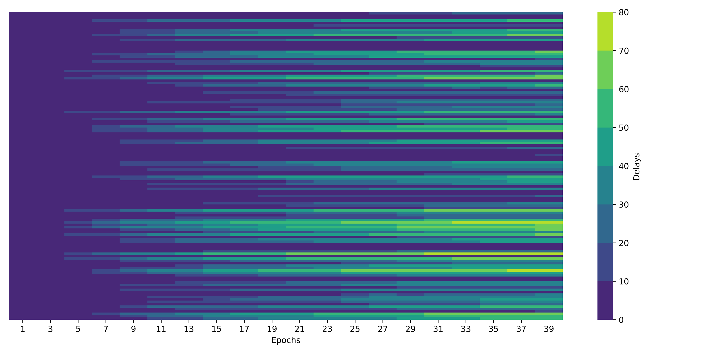
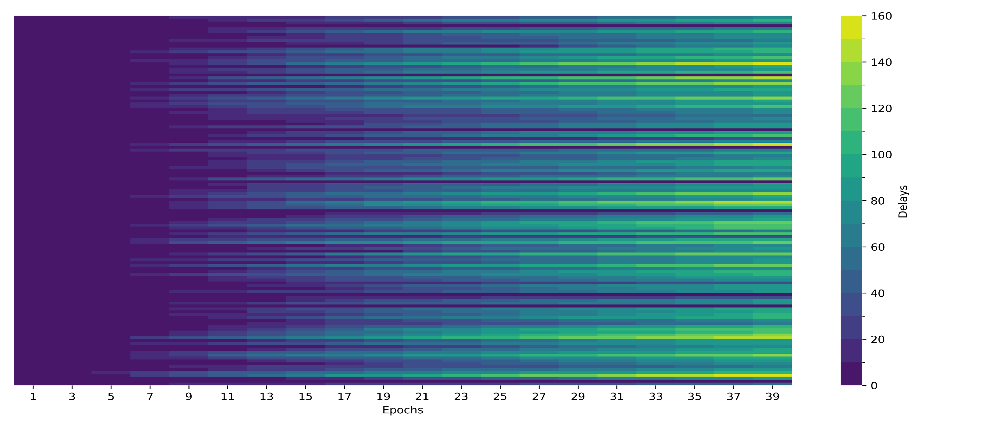
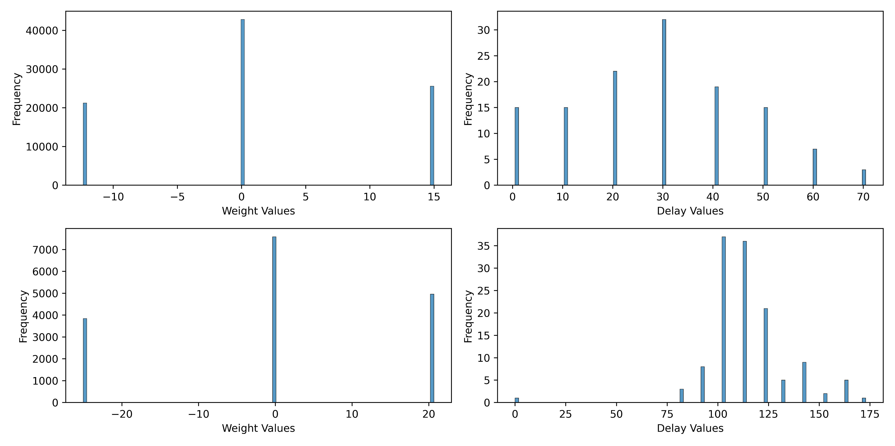

# Exploiting heterogeneous delays for efficient computation in low-bit neural networks
Pengfei Sun, Jascha Achterberg, Zhe Su, Dan F.M. Goodman, Danyal Akarca
Imperial College London, University of Oxford, ETH Zurich

# README #
## Requirements
Python 3 with the following packages installed:

* PyTorch 
* numpy
* matplotlib
* pyyaml
* h5py

A **CUDA** enabled **GPU** is required for training any model.
No plans on CPU only implementation yet.
The software has been tested with CUDA libraries version 11.3 and Pytorch 1.12.1 

## Installation
The repository includes C++ and CUDA code that has to be compiled and installed before it can be used from Python, download the repository and run the following command to do so:

`python setup.py install`

Then 
`pip install torch==1.12.1+cu113  torchvision==0.13.1+cu113  torchaudio==0.12.1    -f https://download.pytorch.org/whl/cu113/torch_stable.html`
）

To test the installation:

`cd test`

`python -m unittest`

## Examples
Example implementations can be found inside Examples folder.

* Run example SHD implementation, with Learnable tenary weights, quantized delays, L2 penalty. You could get >90% performance on SHD datasets. Unzip the SHD dataset and replace it with example/SHD/data/proxy folder (download here: https://drive.google.com/file/d/1XfHOPds7drVKjNJD9y7XKtiDgnq4BGNf/view?usp=drive_link)

```bash
   cd examples/SHD

   python train.py
```
During training, you can visualize how the delays evolve over time in both the first and second layers:



Moreover, by quantizing the delays— for example: self.delay1 = slayer.delay_minmax(128, step=10)
which uses 128 neurons and a dilation step of 10—you can get the performance of 90.4%:
The corresponding quantized weights and delays are:


# Credits # 

The training framework is based on ([SLAYER framework](https://github.com/bamsumit/slayerPytorch))
	
